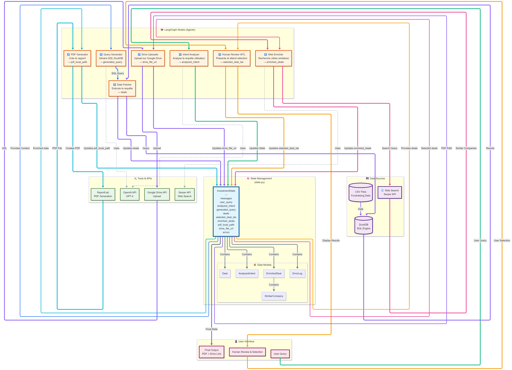

# 🤖 Investment Agent

Un système multi-agents intelligent pour analyser des levées de fonds et générer des rapports d'investissement enrichis via traitement de langage naturel.

## 🎯 Vue d'ensemble

Investment Agent transforme vos requêtes en langage naturel en rapports d'analyse complets. Le système interroge une base de données CSV de levées de fonds, enrichit les résultats avec des recherches web, et génère des rapports PDF professionnels automatiquement uploadés sur Google Drive.

### Fonctionnalités principales

- 🔍 **Recherche en langage naturel** : Posez vos questions naturellement
- 🎯 **Filtrage avancé** : Filtres par date, montant, investisseurs, année de fondation
- 📊 **Analyse SQL intelligente** : Requêtes DuckDB générées automatiquement
- 👤 **Human-in-the-loop (HITL)** : Validation humaine des résultats
- 🌐 **Enrichissement web** : Recherche automatique d'entreprises similaires
- 📄 **Génération PDF** : Rapports professionnels formatés
- ☁️ **Upload Google Drive** : Partage automatique des rapports
- 💻 **Interface Streamlit** : Interface web moderne et intuitive

## 🏗️ Architecture


Le système utilise **LangGraph** pour orchestrer 7 agents spécialisés :

```
Requête utilisateur
    ↓
1. Intent Analyzer (GPT-4) → Analyse l'intention et extrait les critères
    ↓
2. Query Generator (GPT-4) → Génère la requête SQL DuckDB
    ↓
3. Data Fetcher → Exécute la requête sur la base CSV
    ↓
4. Human Review (HITL) → Validation et sélection manuelle
    ↓
5. Web Enricher (Serper API) → Trouve des entreprises similaires
    ↓
6. PDF Generator (ReportLab) → Crée le rapport professionnel
    ↓
7. Drive Uploader (Google Drive API) → Upload et partage
```

### Architecture technique



- **State Management** : Classe `InvestmentState` (Pydantic) comme mémoire partagée
- **Orchestration** : LangGraph pour le workflow multi-agents
- **Base de données** : DuckDB + CSV pour flexibilité et performance
- **Observabilité** : Langfuse (avec fallback gracieux)
- **Interface** : Streamlit avec session state

## 📋 Prérequis

- Python 3.10+
- Compte OpenAI (GPT-4)
- API Serper (recherche web)
- Google Drive API (optionnel mais recommandé)

## 🚀 Installation

### 1. Cloner le dépôt

```bash
git clone <repository-url>
cd AgenticSystem
```

### 2. Environnement virtuel

```bash
python -m venv .venv

# Windows
.venv\Scripts\activate

# macOS/Linux
source .venv/bin/activate
```

### 3. Installer les dépendances

```bash
pip install -r requirements.txt
```

### 4. Configuration

Créer un fichier `.env` :

```bash
cp .env.example .env
```

Remplir avec vos clés API :

```env
# LLM
OPENAI_API_KEY=sk-...

# Web Search
SERPER_API_KEY=...

# Observabilité (optionnel)
LANGFUSE_PUBLIC_KEY=...
LANGFUSE_SECRET_KEY=...
LANGFUSE_HOST=https://cloud.langfuse.com

# Google Drive (optionnel)
GOOGLE_CREDENTIALS_PATH=./credentials.json
```

### 5. Configuration Google Drive (optionnel)

1. Créer un projet sur [Google Cloud Console](https://console.cloud.google.com)
2. Activer Google Drive API
3. Créer des credentials OAuth 2.0
4. Télécharger `credentials.json` dans le dossier racine

### 6. Préparer les données

Placer votre fichier CSV dans `data/fundraising_data.csv` avec ces colonnes :

```
company, website, country, Sector, Tag 1, Tag 2, Tag 3, Tag
Amount raised, Round, Pitch, spotted_date, investors, founding_year
```

Format des montants : `"300.00 M$"`, `"5.00 M$"`, etc.

## 💻 Utilisation

### Lancer l'interface Streamlit

```bash
streamlit run app.py
```

L'interface sera disponible sur `http://localhost:8501`

### Fonctionnalités de l'interface

1. **Barre de recherche** : Entrez votre requête en langage naturel
2. **Filtres avancés** :
   - Plage de dates (`spotted_date`)
   - Montant levé (`amount_raised`)
   - Liste d'investisseurs
   - Année de fondation
3. **Résultats** : Cartes expandables avec détails complets
4. **Sélection** : Choisissez les deals à enrichir
5. **Rapport PDF** : Généré automatiquement et affiché dans l'interface

### Exemples de requêtes

```
✅ "Trouve des levées SaaS en Serie A en France"
✅ "Cherche des startups fintech entre 2M€ et 10M€"
✅ "Levées Serie B en Europe secteur IA après 2023"
✅ "Startups healthtech en seed avec au moins 3M$"
✅ "Toutes les levées avec Sequoia Capital"
```

### Mode ligne de commande (legacy)

```bash
python main.py
```

Ou avec une requête directe :

```bash
python main.py "Trouve des startups fintech en seed en France"
```

## 📂 Structure du projet

```
AgenticSystem/
├── app.py                    # Interface Streamlit
├── main.py                   # Point d'entrée CLI
├── config.py                 # Configuration centralisée
├── state.py                  # Schéma InvestmentState (Pydantic)
├── .env                      # Variables d'environnement (à créer)
│
├── data/
│   └── fundraising_data.csv  # Base de données CSV
│
├── nodes/                    # Logique des 7 agents
│   ├── intent_analyzer.py    # Agent 1 : Analyse d'intention
│   ├── query_generator.py    # Agent 2 : Génération SQL
│   ├── data_fetcher.py       # Agent 3 : Exécution requête
│   ├── human_review.py       # Agent 4 : Validation HITL
│   ├── web_enricher.py       # Agent 5 : Enrichissement web
│   ├── pdf_generator.py      # Agent 6 : Génération PDF
│   └── drive_uploader.py     # Agent 7 : Upload Drive
│
├── tools/                    # Utilitaires API
│   ├── duckdb_tool.py        # Interface DuckDB/CSV
│   ├── serper_tool.py        # Wrapper Serper API
│   └── gdrive_tool.py        # Wrapper Google Drive API
│
├── prompts/                  # Templates de prompts
│   ├── intent_analysis.py
│   ├── query_generation.py
│   └── web_enrichment.py
│
├── utils/                    # Utilitaires généraux
│   ├── logger.py
│   └── helpers.py
│
└── logs/                     # Fichiers de logs
    └── investment_agent.log
```

## 🔧 Configuration avancée

### Filtres disponibles

Dans `app.py`, personnalisez les filtres :

```python
# Plage de dates
spotted_date_range = st.date_input(
    "Date de spotted",
    value=(default_start, default_end)
)

# Montant levé
amount_range = st.slider(
    "Montant levé (M$)",
    min_value=0.0,
    max_value=1000.0,
    value=(0.0, 1000.0)
)

# Investisseurs
investors_filter = st.text_input(
    "Investisseurs (séparés par des virgules)"
)

# Année de fondation
founding_year_range = st.slider(
    "Année de fondation",
    min_value=1990,
    max_value=2025,
    value=(2000, 2025)
)
```

### Paramètres du workflow

Dans `config.py` :

```python
class WorkflowConfig:
    # Limites de résultats
    MAX_RESULTS = None  # Aucune limite (affiche tous les résultats)
    
    # Enrichissement web
    MAX_SIMILAR_COMPANIES_PER_DEAL = 5
    
    # Modèle LLM
    DEFAULT_MODEL = "gpt-4"
    TEMPERATURE = 0.1
```

### Poids de similarité

Ajuster les poids pour l'enrichissement web :

```python
class SimilarityWeights:
    SECTOR_WEIGHT = 0.30    # Importance du secteur
    ROUND_WEIGHT = 0.25     # Importance du round
    TAGS_WEIGHT = 0.25      # Importance des tags
    PITCH_WEIGHT = 0.20     # Importance de la description
```

## 📊 Format des données

### Structure CSV requise

| Colonne | Type | Exemple | Obligatoire |
|---------|------|---------|-------------|
| company | string | "Mistral AI" | ✅ |
| website | string | "mistral.ai" | ✅ |
| country | string | "France" | ✅ |
| Sector | string | "AI" | ✅ |
| Tag 1, Tag 2, Tag 3 | string | "LLM", "Enterprise" | ❌ |
| Amount raised | string | "300.00 M$" | ✅ |
| Round | string | "Serie A" | ✅ |
| Pitch | string | "Description..." | ❌ |
| spotted_date | date | "2024-01-15" | ✅ |
| investors | string | "Sequoia, a16z" | ❌ |
| founding_year | int | 2023 | ❌ |

## 🐛 Troubleshooting

### Erreur "Module not found"

```bash
pip install -r requirements.txt --upgrade
```

### Erreur de parsing JSON (LLM)

Le système implémente un retry automatique avec fallback. Si l'erreur persiste :
- Vérifier la clé API OpenAI
- Augmenter `TEMPERATURE` dans `config.py`

### Erreur DuckDB

```bash
# Vérifier le fichier CSV
duckdb -c "SELECT * FROM 'data/fundraising_data.csv' LIMIT 5;"

# Réinstaller DuckDB
pip uninstall duckdb -y
pip install duckdb
```

### Erreur Google Drive

- Vérifier que `credentials.json` existe
- Activer Google Drive API dans Google Cloud Console
- S'assurer que les scopes sont corrects

### Logs

Consulter les logs détaillés :

```bash
tail -f logs/investment_agent.log
```

## 💰 Coûts

Estimation des coûts par exécution (basée sur GPT-4) :

- **Intent Analysis** : ~$0.005
- **Query Generation** : ~$0.008
- **Web Enrichment** (5 entreprises) : ~$0.015
- **Serper API** : ~$0.009
- **Total moyen** : ~$0.037 par workflow complet

## 🤝 Contribution

1. Fork le projet
2. Créer une branche (`git checkout -b feature/amelioration`)
3. Commit (`git commit -m 'Ajout fonctionnalité'`)
4. Push (`git push origin feature/amelioration`)
5. Ouvrir une Pull Request

### Guidelines

- Code en anglais (commentaires acceptés en français)
- Tests unitaires pour les nouvelles fonctionnalités
- Documentation des changements dans le README

## 📄 Sécurité

⚠️ **Important** : Ne jamais commiter les fichiers suivants :

- `.env` (clés API)
- `credentials.json` (Google Drive)
- `data/*.csv` (données sensibles)
- `logs/*.log` (peut contenir des infos sensibles)

Ces fichiers sont déjà dans `.gitignore`.

## 📝 Licence

MIT License - Voir le fichier `LICENSE` pour plus de détails

## 👤 Auteur

**NIGOTO Thomas**

## 🙏 Remerciements

- **LangGraph** : Framework d'orchestration multi-agents
- **OpenAI** : GPT-4 pour l'analyse et la génération
- **Anthropic** : Claude pour le développement assisté
- **Serper** : API de recherche web
- **Streamlit** : Framework d'interface web

---

**Note** : Ce projet utilise des API payantes (OpenAI, Serper). Consultez les tarifications avant utilisation intensive.

**Version** : 2.2.0 | **Dernière mise à jour** : Novembre 2024
